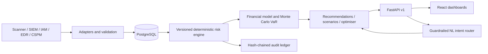
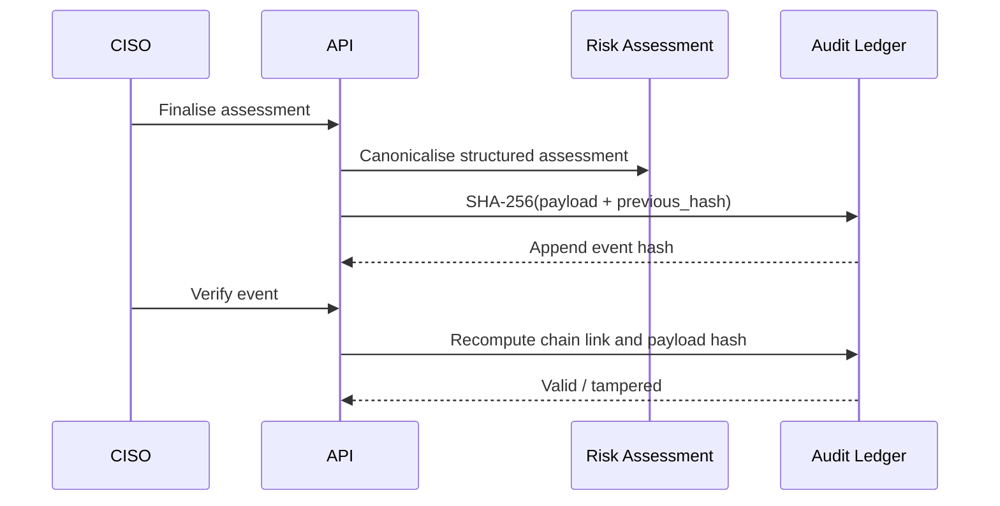

# Architecture

## Design choice

SentinelLedger is a modular monolith to keep the SIH deployment reliable while preserving clear boundaries for later scaling. Its risk mathematics lives in deterministic services; AI never calculates or supplies source-of-truth numerical values.

## Request and data flow

1. An adapter receives CSV, JSON, or REST data with a source identifier and event key.
2. Pydantic validates it and a normaliser maps it to internal schemas. Duplicate source/event pairs are rejected.
3. A risk recalculation combines asset, vulnerability, threat, incident, and control evidence using a documented model version.
4. Financial services convert probability and loss components into EAL, confidence bounds, and an empirical loss distribution for VaR.
5. Scenario and optimisation services reuse those services rather than maintaining separate numbers.
6. API responses include model version, calculation time, input factors, and data freshness. The UI displays them as modelled estimates.

## Core formulas (v1.0.0)

All terms are clamped to `[0, 1]` where applicable. Constants live in `risk/config.py`, not route handlers.

- **Asset criticality** = weighted mean of business criticality (0.30), revenue dependency (0.25), data sensitivity (0.20), operational dependency (0.15), and internet exposure (0.10).
- **Likelihood** = base rate adjusted by CVSS, exploitability, asset exposure, vulnerability age, threat activity, historical incident signal, and effective control coverage.
- **Expected loss per incident** = downtime + breach + recovery + regulatory + legal + business impact.
- **EAL** = annual incident frequency × expected loss per incident.
- **Residual risk** = inherent risk × (1 − effective control reduction).
- **ROSI** = `(modelled risk reduction − investment cost) / investment cost × 100`.
- **Cyber VaR** is an empirical percentile (P90/P95/P99) of simulated one-year cyber-loss outcomes. It is an estimate under the stated model—not a promise of maximum loss.

## Audit flow

## Security boundaries

- JWT authentication and role checks protect API endpoints.
- Input validation enforces probability, effectiveness, CVSS, currency, and timestamp ranges.
- Audit records contain only canonical assessment metadata and hashes, never raw secrets or sensitive telemetry.
- The natural-language endpoint dispatches an allow-listed intent to structured services; it has no SQL or shell access.

## Deployment

The compose topology comprises `frontend`, `backend`, and `postgres`. Environment-dependent settings are injected through environment variables. A seeded offline mode keeps the core demo operational without internet access.
